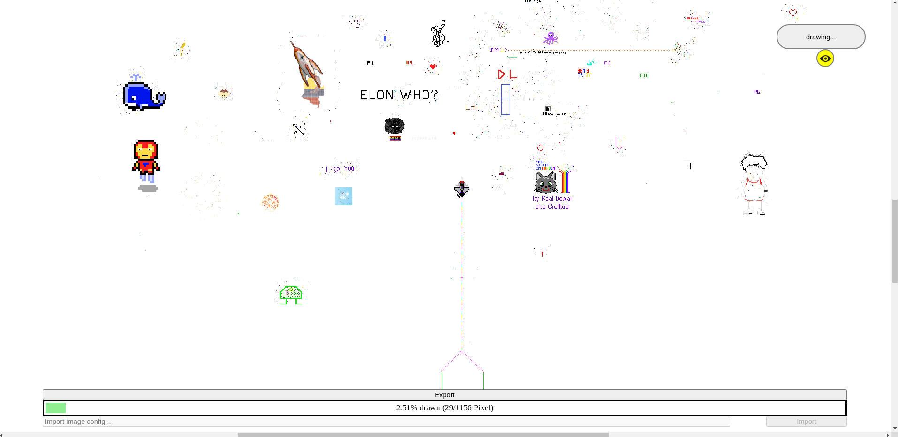
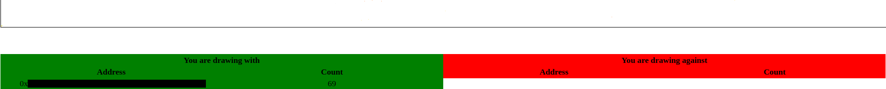

# PoapArtBot
_Automated drawing interface for poap.art_

This unofficial tool automates the drawing of images (later: text, ...) on the [poap.art website](poap.art).
Simply drag-and-drop your image on the canvas and start drawing. It will approximate the colors to the limited set of 256,
so the colors of your image might look a bit different than expected.

__This tool is still in an early version. It was hacked together in a very short time, there is a lot to improve.
Feel free to report issues and/or help developing.__

## Installation
For now you'll need to use a terminal, I'll try to explain everything in detail.
### Prerequisites
- Open a terminal:
  - Linux: hit `CTRL + SHFT + T`
  - Windows: go to windows -> type `cmd` -> hit enter
- You'll need python3 and git installed. Google will help you installing these.

### Install
1. Download the repository (to your current directory): `git clone https://github.com/RomiRand/PoapArtBot.git`
2. Change directory: `cd PoapArtBot`
2. Start the local HTTP-Server using python: `./StartBot.sh` \
   Windows users should run `StartWindows.bat`

## Usage
0. Visit the page: [localhost:8080](localhost:8080)
1. Connect metamask (other web3 providers not tested yet)
2. Sign in (make sure you've the correct POAP in your wallet!)
3. Import an image
   1. Drag-and-drop it onto the canvas. You can use local files or images from the web.
   2. Import someone else's image (see below): If you trust their config (especially the URL),
      you can paste the entire string into the input area at the bottom of your screen and hit `import`.
3. You can click and grab the image again to move it around. If you also hit `Ctrl`, you can scale it.
4. Once you're happy, hit `draw!`
5. You can draw together with your friends (__Your image needs to be from the internet__). Click `Export`
   at the bottom to copy your image configuration to your clipboard. Anyone you send it to can help you now.
   You can also use this config for yourself (e.g. to continue drawing after a pause). \
   __NOTE__:
   - If you are drawing with others, it's advised to draw random pixels.
   - Some images don't work (due to a security feature of browsers).
     If you have issues importing, you can try to upload it to another site ([imgur](https://imgur.com/) seems to work).
6. Monitor the drawing status via the progress bar at the bottom. You can also keep it running after you reached
   100% to protect it from pixel attackers!
7. Below the canvas you can find a detailed list of all "friendly and hostile" artists
   (collected locally after you start drawing).
8. You might also be interested in [PoapArtParticipants](https://github.com/RomiRand/PoapArtParticipants), another weird
   tool with weird UI. It helps you to collect all the drawers of a custom area.
9. Don't forget to stop your HTTP-Server when you're done: Hit `Ctrl + c` in the terminal window

## Testing
There is a [weekly sandbox canvas](https://sandbox.poap.art/) that can be used for testing.

## Contribute
Unfortunately, [poap.art](poap.art) isn't open source (let's hope it will be soon!),
so I basically needed to rebuilt all the relevant client-side parts of it.
I'm no professional at reverse engineering websites and didn't even do anything with js before really,
so there's definitely a lot you could help with.

# Disclaimer
The author(s) take no responsibility for any harms caused by this tool.
